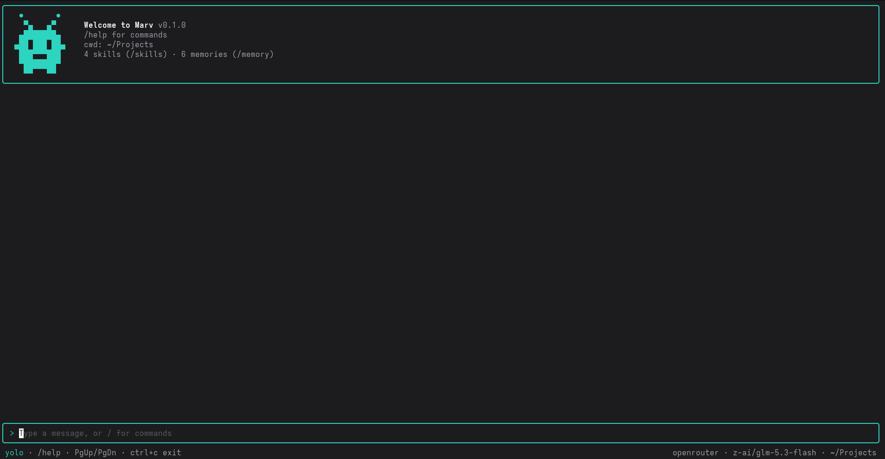

<p align="center"></p>

# Marv

A terminal coding agent. Marv reads your code, edits files and runs commands (sandboxed, and asking for your approval wherever the sandbox can't contain what it does), inside a full-screen terminal UI with a little martian for company.

Marv is written in TypeScript on [Bun](https://bun.sh), with an [Ink](https://github.com/vadimdemedes/ink) (React for the terminal) interface. It talks to models through [OpenRouter](https://openrouter.ai) (hundreds of cloud models with one API key) or [Ollama](https://ollama.com) (models running on your own machine).



## Features

- **An agent loop with tools.** It can read, search (`glob`, `grep`), edit, write, and run shell commands. The model decides which tools to use; Marv runs them and reports back.
- **Safe yolo mode (on by default).** Sandboxed commands and edits inside the project run without asking; anything the sandbox can't contain (network access, git commits and other repository changes, `.git` itself, memory) still shows you a colored diff or the exact command first: yes, yes for the rest of the session, or no (which stops Marv so you can redirect it). `/yolo off` asks for every change.
- **Sandboxed commands.** On Linux, commands run in [bubblewrap](https://github.com/containers/bubblewrap): only the project folder is writable, your home folder (keys, SSH, Marv's own config) is hidden, there's no network unless a command asks for it, and API keys never reach the command.
- **Any model.** OpenRouter or a local Ollama model, with a searchable model picker showing prices. Switch with `/model`.
- **MCP servers.** Connect any [Model Context Protocol](https://modelcontextprotocol.io) server, local or remote, in `.mcp.json` or `~/.marv/mcp.json` (Claude Code's format). Its tools join Marv's; calls ask first unless the server marks a tool read-only, since servers run outside the sandbox. A project's servers only start once you trust them (`/mcp trust`).
- **Skills.** Drop a `SKILL.md` into `.marv/skills/` (or `~/.marv/skills/`) and Marv loads it when a task matches, or run it yourself with `/<skill-name>`.
- **Subagents.** Marv can hand a task to a fresh agent with its own context, which reports back when it's done, so the files it read don't fill up the conversation. Several can run in parallel, each in its own git worktree if they change files. Click one to watch its own transcript live. Agent types are Markdown files, compatible with Claude Code's.
- **Memory.** Marv remembers your preferences and project facts across sessions. Every change it makes to its memory needs your approval.
- **Sessions.** Every conversation is saved; `marv -c` continues the last one, `/resume` picks an earlier one.
- **Long conversations.** When the context window fills up, Marv summarizes the conversation and carries on (`/compact` does it on demand). Requests reuse the provider's prompt cache wherever possible.
- **Trajectories and feedback.** Every turn is logged step by step (requests, replies, tool calls, subagents, timings, tokens) to `~/.marv/trajectories/`, with your ratings: `/good`, `/bad`, `/label`, and what your next message implies ("thanks, perfect" or "that's wrong"). `bun run stats` sums them up per model or Marv version, so you can measure whether a change made runs better.
- **No dead stops.** After 25 steps without finishing, Marv asks whether to keep going instead of giving up.
- **Cost tracking.** OpenRouter's actual charge per request, plus context and cache use, in the status bar; `/cost` for the breakdown.
- **A comfortable TUI.** Streaming Markdown replies, mouse-wheel scrolling, drag-to-copy with auto-scroll, a `/` command menu, and Esc to interrupt.

## Requirements

- [Bun](https://bun.sh) 1.3 or newer.
- One of:
  - an [OpenRouter API key](https://openrouter.ai/settings/keys), or
  - [Ollama](https://ollama.com) running locally, with a model that supports tool calling (e.g. `ollama pull qwen3.5:9b`).
- Linux with `bubblewrap` (`bwrap`) for the command sandbox. Without it, Marv still works, but every command prompt warns that it runs unsandboxed.

## Install

```sh
bun add -g @flologixai/marv    # or: npm install -g @flologixai/marv (Marv still runs on Bun)
```

Or from source, to hack on it:

```sh
git clone https://github.com/FlologixAI/marv.git
cd marv
bun install    # also applies the patches in patches/
bun link       # puts `marv` on your PATH
```

Then start it in any project folder:

```sh
cd ~/some/project
marv
```

The first run opens a short setup: pick OpenRouter or Ollama, pick a model, and (for OpenRouter) paste your key. Settings are saved to `~/.marv/config.json`, readable only by you. Run `/setup` to change them later.

## Using Marv

Type what you want in plain language, for example:

```
> how does the config loading work?
> add a --verbose flag to the CLI and update the help text
> run the tests and fix whatever fails
```

### Commands

| Command | What it does |
|---|---|
| `/help` | Show available commands and shortcuts |
| `/model` | Pick a model (`/model <id>` to set one directly) |
| `/setup` | Change provider, model, or API key |
| `/config` | Show the current configuration |
| `/think` | Let thinking models reason before answering (`/think on`, `/think off`) |
| `/skills` | List available skills; run one with `/<skill-name> <request>` |
| `/agents` | List the subagent types Marv can start |
| `/memory` | Show what Marv remembers |
| `/remember` | Save a note to memory (`/remember <note>`, or `/remember project: <note>`) |
| `/forget` | Remove a memory (`/forget <text from it>`) |
| `/resume` | Pick up an earlier session in this project |
| `/compact` | Summarize the conversation to free up context (`/compact <what to keep>`) |
| `/cost` | Tokens used and cost so far |
| `/sandbox` | Show or set the command sandbox (`/sandbox on`, `/sandbox off`) |
| `/yolo` | Run what the sandbox contains without asking (`/yolo on`, `/yolo off`) |
| `/good`, `/bad` | Rate the last turn, with an optional note (`/bad edited the wrong file`) |
| `/label` | Tag the last turn (`/label refactor, tests`) |
| `/mcp` | Show MCP servers and their tools; `/mcp trust` starts the project's |
| `/trajectories` | Show or set run logging (`/trajectories on`, `/trajectories off`) |
| `/clear` | Start a fresh conversation (the old one stays saved) |
| `/exit` | Quit |

Type `/` to open the command menu: ↑/↓ to choose, Enter to run, Tab or → to complete.

### Keys

| Key | Action |
|---|---|
| Esc | Stop a reply or a running tool (in a subagent's view: go back) |
| ctrl+c | Stop / clear the input / press twice to quit |
| ctrl+o | Show or hide details: what subagents did, and whole diffs |
| Click a subagent | Open its own transcript, live |
| PgUp / PgDn, mouse wheel | Scroll the conversation |
| Drag with the mouse | Select text; it's copied when you let go (drag past the edge to scroll) |
| ↑ / ↓ | Previous inputs |

### Command-line options

```
marv              start an interactive session
marv -c           continue the latest session in this folder (--continue)
marv -r           pick an earlier session to resume (--resume)
marv --version    print the version
marv --help       show the help
```

## Safety model

Marv is built so that you stay in control of what changes on your machine:

1. **Reading is free; what can't be contained needs approval.** Reading and searching files never asks. With yolo mode on (the default), commands that run in a working sandbox without network, and edits inside the project (but not in `.git`), run without asking; everything else shows you exactly what will happen first: a command that wants the network or changes the git repository (it must say so with `git_write`), an edit inside `.git`, any command when the sandbox is off or unavailable, and every memory change. With `/yolo off`, every edit and command asks. "Don't ask again" covers the rest of the session only: all file edits, or one exact command.
2. **`.git` is protected.** Git runs hooks and config from `.git` outside any sandbox (your next commit would run a planted hook with full access), so commands that run without asking see it read-only. What yolo can't protect: files you later run yourself outside the sandbox, like scripts and `package.json`; review with `git diff` before running them.
3. **Paths are confined to the project.** Tools refuse anything outside the folder Marv was started in, including through symlinks.
4. **Commands run in a sandbox.** The system is read-only and the home folder is hidden (toolchains like `~/.bun` and your git config are mounted read-only). The project folder is the only writable place, and there's no network unless the command asks for it, which the approval prompt shows. The environment starts empty, so API keys can't leak into commands.
5. **Memory changes are approved too.** Memory comes back in every future session, so an instruction planted by a malicious file and saved there would be a persistent prompt injection. You see every memory before it's saved.
6. **MCP servers are trusted explicitly, and their calls ask.** A server is a program running with your permissions, outside the sandbox, so a project's `.mcp.json` servers start only after `/mcp trust` (for that exact config and the project scripts it names: if either changes, it asks again; you're shown the config as written, with the environment variables it reads, never your secrets), and every call asks unless the server marks the tool read-only. Yolo mode never skips these. Local servers get no API keys from Marv's environment, only what their config gives them. Your own servers start in your home folder, not the project (so a package planted in the project can't stand in for one); use `${MARV_PROJECT_DIR}` in their arguments if they need the project path. What a server returns is treated as data, not instructions.
7. **Subagents ask like Marv does, or work in a worktree.** A subagent in the project folder asks before each change, and the prompt says which one is asking. One in its own git worktree is approved once when it starts; inside its sandboxed worktree its edits and commands then run without asking, except commands that want the network (and with the sandbox off, everything asks). It can't touch the repository's `.git` (it's read-only in the sandbox, so no commits, branch moves, hooks or config), and when it's done, Marv commits its changes to its branch, without running any of the repository's hooks. Its work comes back as a branch you (or Marv, with your approval) review and merge. Esc at an approval prompt declines everything waiting and stops the run.

## Skills

A skill is a folder with a `SKILL.md`:

```markdown
---
name: release-notes
description: How to write release notes for this project. Use when asked for release notes or a changelog.
---

1. Run `git log` since the last tag…
2. Group the changes into Added / Changed / Fixed…
```

Put it in `.marv/skills/<name>/` (this project) or `~/.marv/skills/<name>/` (all projects). Only each skill's name and description go into the system prompt; Marv loads the full instructions when a request matches. A skill folder can also hold scripts and reference files. Write descriptions that name the task and when to use it: that's how the model decides.

## Agents

An agent type is a Markdown file, in the same format as Claude Code's agent files:

```markdown
---
name: code-reviewer
description: Reviews a change for bugs and missing tests. Use after implementing a task, before merging it.
tools: read_file, grep, glob, bash   # optional; Claude Code names (Read, Grep, Edit…) work too
model: inherit                       # optional; or a model id on the same provider
---

You are a careful code reviewer. Read the diff, then the code around it…
```

Put it in `.marv/agents/<name>.md` (this project) or `~/.marv/agents/<name>.md` (all projects); there's also a built-in `general-purpose` agent with every tool. A subagent starts with a fresh conversation that holds only the task it was given, and never gets the `agent` or `memory` tools. Only names and descriptions go into the system prompt, so write descriptions that say when to use the agent. A reference like `superpowers:code-reviewer` finds `code-reviewer`, so skills written for Claude Code work unchanged. `/agents` lists what loaded, and why any file didn't.

## Files and settings

| Path | Contents |
|---|---|
| `~/.marv/config.json` | Provider, model, API key (mode 0600) |
| `~/.marv/sessions/<project>/` | Saved conversations (private) |
| `~/.marv/trajectories/<project>/` | Every turn, step by step, with your ratings (private; `bun run stats` to sum up) |
| `~/.marv/memory/personal.md` | Personal memory, used in every project |
| `~/.marv/memory/projects/<project>.md` | Memory for one project (never stored in the repo) |
| `~/.marv/skills/` | Your personal skills |
| `.marv/skills/` | The project's skills |
| `~/.marv/agents/` | Your personal agent types |
| `~/.marv/mcp.json`, `.mcp.json` | MCP servers: yours, and the project's (`{"mcpServers": {"name": {"command": …} or {"type": "http", "url": …}}}`) |
| `~/.marv/mcp-trust.json` | Which project MCP servers you've trusted |
| `.marv/agents/` | The project's agent types |
| `~/.marv/worktrees/<project>/` | Subagents' worktrees while they run (removed when each finishes; its branch stays) |
| `AGENTS.md` | Project instructions, read into the system prompt at startup |

| Environment variable | Effect |
|---|---|
| `OPENROUTER_API_KEY` | Overrides the saved OpenRouter key |
| `MARV_MODEL` | Overrides the saved model |
| `OLLAMA_HOST` | Where Ollama runs (default `localhost:11434`) |
| `MARV_CONFIG_DIR` | Use a different folder instead of `~/.marv` |

Ollama's context window defaults to 32k tokens (`contextLength` in the config file). That is large enough for an agent to read code, and fits in 12 GB of VRAM for 9-12B models.

## Using Marv from code

Marv's engine is a library too: `@flologixai/marv/sdk` gives your Bun program the same agent the terminal runs
(the tools, subagents, MCP servers, compaction, saved sessions), without the terminal.

```sh
bun add @flologixai/marv
```

```ts
import { createSession } from "@flologixai/marv/sdk";

const session = await createSession({
  cwd: "/path/to/project",
  provider: { kind: "openrouter", apiKey: process.env.OPENROUTER_API_KEY! },
  // or { kind: "ollama", model: "qwen3.5:9b" }, or a Provider of your own
});

for await (const event of session.send("Fix the failing test")) {
  if (event.type === "text_delta") process.stdout.write(event.text);
}
await session.close();
```

- **Turns and events.** `send()` starts a turn at once and returns its events: `turn_start` first and
  `turn_end` last, exactly once however it ends, with the model's text, tool calls (`tool_start`/`tool_end`),
  subagents' events (`subagent`, tagged with the call that started them), `status` (waiting for MCP servers,
  compacting, running), compaction, and `cut_off` (a reply hit the output limit, so nothing in it ran; the
  model is told and goes on, and a second one in a row ends the turn) in between. A file change's `tool_end`
  (`edit_file`, `write_file`) carries `result.diff`: what changed, as numbered lines, for display; the model
  never sees it. Leaving the loop early interrupts the turn (and waits until
  every tool call it started has its result); so do `interrupt()` and a `signal`. A turn you never read still
  runs to the end. One turn at a time: `send()` and `clear()` throw during one, `resume()` and `compact()`
  reject; the session is free again just before `turn_end`, so you can send the next message from there.
- **Approvals.** Pass `approve: async (request) => "yes" | "always" | "no"` to decide what runs. Without it,
  only what needs no yes runs: read-only tools, what Marv's yolo mode vouches for (edits outside `.git`,
  sandboxed commands without network), subagents (shared-folder ones under these same rules; worktree ones
  when sandboxed), and MCP tools whose server says they're read-only. Anything else goes back to the model as
  refused, and it carries on. The sandbox is bubblewrap, on Linux: without it (macOS, say) every `bash`
  command needs an approver. With no one to ask, the 25-step limit is a hard stop too.
- **Not in your home folder with yolo.** Yolo's safe edits run before any approver is asked, so with `cwd`
  your home folder, a folder above it, or `/`, they'd change your dotfiles unasked. `createSession` refuses
  that unless you pass `yolo: false` (then every change goes to your approver, or is refused without one),
  and `configure({ yolo: true })` can't turn it back on there.
- **Review before you run.** What the agent writes can plant something you'll later run outside the
  sandbox. Edits that run unasked are kept out of `.git` (hooks, config), but a `package.json` script, a
  `Makefile` or an `.envrc` is an ordinary file. In a repository you don't trust, read the changes
  (`git diff`) before running anything in it.
- **Nothing from disk unless asked.** `sources: ["project"]` reads the repository's `AGENTS.md`, `.marv/` and
  `.mcp.json` (whose servers still need trusting); `"user"` reads your `~/.marv` (skills, agents, memory, MCP
  servers). Environment variables like `OPENROUTER_API_KEY` and `MARV_MODEL` are ignored: the session uses what
  you pass. `persist: true` saves the conversation where `marv -r` finds it, and `resume: id | "latest"` (with
  `persist`) continues one; `trajectories: true` logs every turn.
- **MCP servers in code:** `mcpServers: { name: { command, args } }` (`.mcp.json`'s format). These are trusted like
  your own: no trust prompt, started in your home folder (use an absolute path, or `${MARV_PROJECT_DIR}` for
  the project). So never pass config read from a repository you don't control; `sources: ["project"]` is the
  way to use a repository's servers, and those still need trusting.
- **Your own tools:** `tools: [{ name, description, input: z.object({...}), label, run }]`, offered to the
  main agent (not to subagents). `input` must be a zod 4 schema (it's described to the model with
  `z.toJSONSchema`). A name of a built-in tool, one used twice, or one starting with `mcp__` (MCP servers'
  tools) makes `createSession` throw. A Provider of your own is used for everything, subagents included.
- **Settings between turns.** `configure({ provider, thinking, sandbox, yolo })`: a turn reads its settings
  when it starts, so a change during one applies from the next. It throws only for an invalid provider (an
  unknown `kind`) or for turning yolo on in the home folder, and then nothing changed. `close()` stops what's running, waits for it, saves, and stops
  the MCP servers the session started; `send()` throws after it.
- **Files.** `configDir` (default `~/.marv`) moves config, memory, `mcp.json`, sessions, trajectories,
  worktrees and MCP trust; personal skills and agents are still read from `~/.marv` in your home folder, as
  the CLI does. A repository's MCP servers can only be trusted with the CLI's `/mcp trust`. `onWarning`
  hears what doesn't fit a turn's events (a trajectory that can't be written).
- **Bun only** (1.3 or newer). The SDK is TypeScript source, so your `tsconfig.json` needs
  `"moduleResolution": "bundler"` and `"allowImportingTsExtensions": true` (`bun init`'s defaults have both).

`examples/sdk.ts` is a complete script.

## Development

```sh
bun install
bun run dev          # run from source
bun test             # the test suite
bun run typecheck    # tsc --noEmit
bun run stats        # sum up your trajectory logs (--by model or --by marv)
```

The architecture and conventions are documented in [`CLAUDE.md`](CLAUDE.md) (also available as `AGENTS.md`): the provider seam, the agent loop, the tool registry, the prompt-cache rules, and how the TUI renders.

Three dependencies are patched (in [`patches/`](patches/), applied by `bun install`):

- **ink**: adds a `transformOutput` hook and `repaint()` (for drawing the mouse-selection highlight), skips drawing off-screen nodes, and skips a whole-tree search for `<Static>` on every update. Long sessions would otherwise slow every frame.
- **string-width**: caches results and skips a costly emoji regex for characters that can't be emoji, which was the biggest cost while scrolling.
- **ink-text-input**: ignores ctrl+letter (only letters: ctrl+arrows still move the cursor), so shortcuts like ctrl+o don't type the letter into the prompt.

Edit a patch with `bun patch <package>`, change the files in `node_modules/<package>`, then run `bun patch --commit node_modules/<package>`.

Patches only apply in a clone, so the published CLI is bundled with them: see Releasing.

### Releasing

```sh
bun run release:build                        # builds the package into release/
npm pack ./release                           # optional: the exact tarball, to install and try somewhere else
npm publish ./release --access public        # needs `npm login`; scoped packages are private by default
git tag v0.1.0 && git push origin v0.1.0
gh release create v0.1.0 --generate-notes
```

Bump `version` in `package.json` first: a version number can only be published once. `release:build` bundles the CLI
(with the patched dependencies inside, since Bun applies patches only in this repository) into `release/dist/`, copies
`src/` for the SDK, and writes a `package.json` without `patchedDependencies`, the scripts or the devDependencies; the
SDK's dependencies are the packages its files import. The repository's own `package.json` is `private`, so a
`npm publish` from the root is refused.

## License

[MIT](LICENSE) © FlologixAI. "Marv" and the martian are FlologixAI's; forks are welcome under another name.
